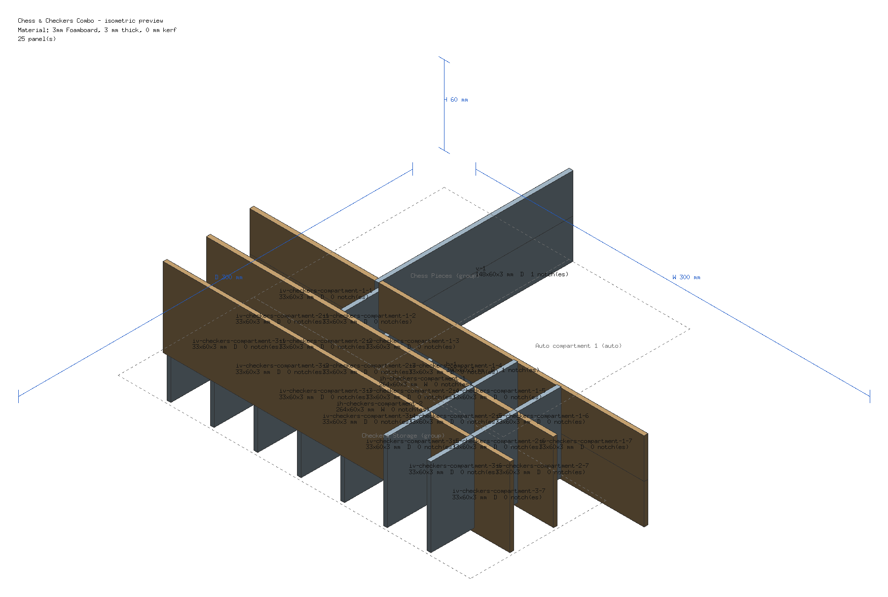
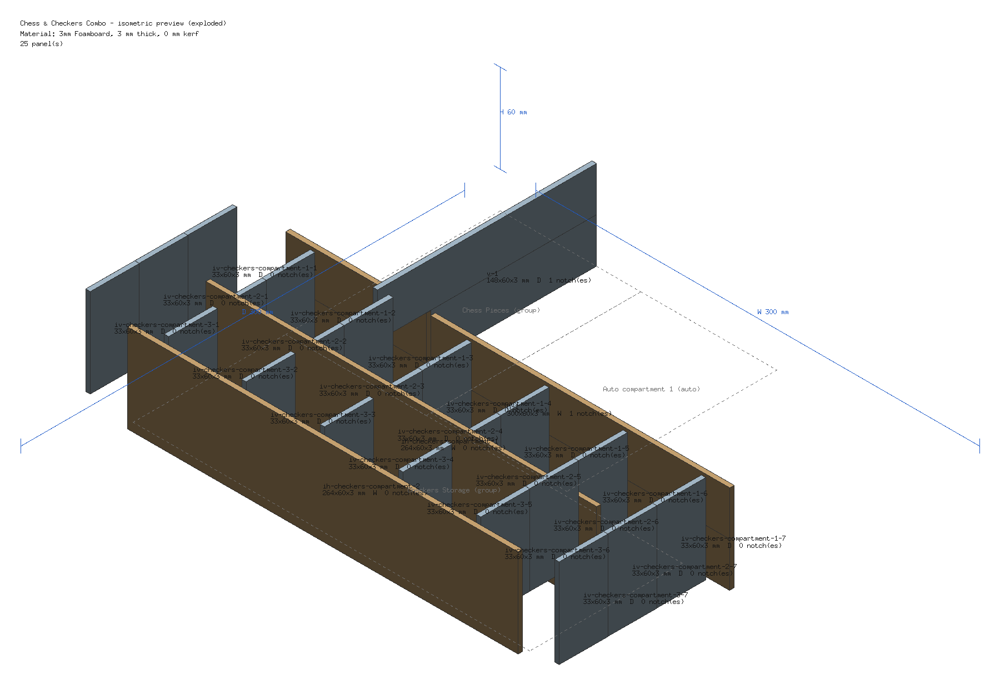

# cubby

[](https://github.com/Desvelao/cubby/actions/workflows/ci.yml)
[](https://github.com/Desvelao/cubby/releases)
[](LICENSE)

`cubby` designs slotted divider-panel inserts for boardgame boxes from a
YAML manifest. Describe your box and its components, group them into
compartments, and `cubby` packs everything into the available space,
reports what fits and what doesn't, and exports a cuttable/printable design.

The design is an "egg-crate" style grid of interlocking divider panels, cut
from a flat sheet material — foamboard (hand-cut with a knife), plywood or
acrylic (laser-cut), or cardboard. Material, thickness, and laser kerf are
just manifest parameters; the geometry is the same either way.

## Install

### Download a release

Prebuilt archives for Linux, macOS and Windows (amd64 and arm64) are attached
to each release on the
[GitHub Releases page](https://github.com/Desvelao/cubby/releases). Archives
use GoReleaser's default naming, `cubby_<version>_<os>_<arch>`, where
`<version>` has no leading `v`: `.tar.gz` for Linux and macOS, `.zip` for
Windows. For example:

- `cubby_0.1.0-alpha1_linux_amd64.tar.gz`
- `cubby_0.1.0-alpha1_darwin_arm64.tar.gz`
- `cubby_0.1.0-alpha1_windows_amd64.zip`

Each archive contains the `cubby` binary (`cubby.exe` on Windows), `LICENSE`,
`README.md` and the example manifests (`examples/*.yaml`). On Linux or macOS:

```sh
tar -xzf cubby_0.1.0-alpha1_linux_amd64.tar.gz cubby
sudo mv cubby /usr/local/bin/
cubby version
```

On Windows, extract the `.zip` and put `cubby.exe` in a folder on your
`PATH`. Every release also includes a `checksums.txt` file to verify the
downloads.

### Docker (no local Go required)

A multi-arch (linux/amd64, linux/arm64) image is published to GHCR for each
release. Use a specific release tag, or `latest`, which only tracks stable
`vX.Y.Z` releases (prereleases such as `v0.1.0-alpha1` get only their own tag):

```sh
docker run --rm --user "$(id -u):$(id -g)" -v "$PWD":/work -w /work \
  ghcr.io/desvelao/cubby:<tag> build examples/chess-checkers.yaml
```

Or build the image yourself from a checkout:

```sh
docker build --target runtime -t cubby .
docker run --rm --user "$(id -u):$(id -g)" -v "$PWD":/work cubby build /work/examples/chess-checkers.yaml
```

The image runs as a non-root user (uid 65532) by default. Pass
`--user "$(id -u):$(id -g)"` as above so files written to the bind mount are
owned by you and the container can write to your directory.

### From source

```sh
cd src
go build -o cubby ./cmd/cubby
```

Requires Go 1.23+. `make build` does the same and writes `src/bin/cubby`.
`go install` is not supported because the Go module lives in `src/`.

`go install github.com/Desvelao/cubby/cmd/cubby@latest` does not work:
the Go module lives in `src/` (there is no `go.mod` at the repository root),
so build from source as above, or use a release binary or the Docker image.

## Quick start

```sh
cubby validate examples/chess-checkers.yaml
cubby list examples/chess-checkers.yaml
cubby groups examples/chess-checkers.yaml
cubby build examples/chess-checkers.yaml --format svg,dxf --out-dir ./out
```

## Examples

Isometric previews of `examples/chess-checkers.yaml`, assembled and exploded
(`cubby build examples/chess-checkers.yaml --format iso-png,iso-png-exploded`):

<p>
  
  
</p>

More manifests and demo renders are listed in [`examples/README.md`](examples/README.md).

## The manifest

A manifest is a single YAML document describing the box, the material, the
components and how to group them. A minimal example:

```yaml
version: 1

box:
  name: "Chess & Checkers Combo"
  units: mm                 # mm | cm | in (default mm)
  interior:
    width: 300
    depth: 300
    height: 60

material:
  name: "3mm Foamboard"
  thickness: 3.0            # in box.units
  kerf: 0.0                 # in box.units; extra slot clearance; 0 for hand-cut, ~0.1-0.2 for laser

defaults:
  padding: 1.0               # clearance around each component's footprint
  margin: 1.5                # clearance around a compartment vs the box wall / other compartments

components:
  - id: chess-pieces-box
    name: "Chess Pieces Tray"
    width: 140
    depth: 90
    height: 40
    qty: 1
  - id: checkers-red
    name: "Red Checkers"
    width: 30
    depth: 30
    height: 8
    qty: 12
  - id: rulebook
    name: "Rulebook"
    width: 140
    depth: 90
    height: 8
    qty: 1
    allowRotate: false        # default true

groups:
  - id: chess-compartment
    name: "Chess Pieces"
    components: [chess-pieces-box]
```

Groups are explicit compartments; ungrouped components (like `rulebook`) are
packed automatically into the space left over.

**Full reference: [docs/manifest.md](docs/manifest.md)** covers every field,
units, inheritance rules, the layout options (`fillRemaining`, `fullWalls`,
`jointType`, `dividers`, `expand`, `removable`, `floor`), the optional
`project:` metadata block, all validation rules and error messages, exit
codes, and editor autocompletion via
[docs/manifest.schema.json](docs/manifest.schema.json). See also
[`examples/`](examples/) for complete manifests.

## Documentation

- [docs/manifest.md](docs/manifest.md): the manifest (configuration file)
  reference.
- [docs/manifest.schema.json](docs/manifest.schema.json): JSON Schema for
  editor validation and autocomplete of manifests.
- [examples/](examples/): ready-to-run manifests (`overfull.yaml` is an expected-failure demo that exits with code 3).

## Commands

| Command | What it does |
|---|---|
| `cubby validate <manifest>` | Checks schema, cross-references, and geometric feasibility of the box/material/margin parameters (thickness, margin plus wall, and floor against the interior); never packs, so components that merely do not fit still validate. `--format text\|json` (default `text`). Also the command that checks height reductions against rendering (like `build`, it lays out and renders a manifest that sets one); `list` and `groups` never render. Prints the build-time height-reduction warnings (unmatched `panels` entries, unused `externalHeightReduction`) to stderr and `--strict` makes them fail with exit 2. |
| `cubby list <manifest>` | Lists declared components (`--format table\|csv\|json`, default `table`; `--group <id>` filters to one group, `--group -` lists ungrouped components). |
| `cubby groups <manifest>` | Fast fit-check: packs the manifest and reports used/remaining/missing space per compartment, without generating geometry. `--format table\|json` (default `table`); `--group <id>` shows only that compartment (table and JSON) and exits 1 on an unknown id. |
| `cubby build <manifest>` | Full pipeline: pack, generate the slotted-panel design, and export it. |
| `cubby version` | Prints build version info. |

### JSON output schema

`list`, `groups` and `validate` accept `--format json`. Keys are lowercase
camelCase (matching the manifest), all lengths are millimeters, and empty
lists are always `[]`, never `null`, so `jq '.[]'` and similar work on empty
results. This contract changed from earlier releases, which emitted Go-cased
keys (`ID`, `BoxName`, ...) and `null` for empty lists.

- `list`: a JSON array of `{id, name, group, width, depth, height, qty}`
  (`group` is `"-"` for ungrouped components; dimensions are as authored in
  the manifest).
- `groups`: an object `{boxName, interiorW, interiorD, interiorH, compartments,
  usedW, usedD, remaining, totalMissing, material, project}`.
  `remaining` is `{width, depth, area}`; `material` is `{name, thickness, kerf}`.
  `project` appears only when the manifest has a `project:` block that sets
  something; it holds the fields that are set, keyed as in the manifest
  (`name`, `description`, `revision`, `author`, `contact`, `license`, `url`,
  `tags`, `created`, `updated`, `notes`, `game`, `publisher`, `edition`), with
  `tags` as an array of strings and dates as `YYYY-MM-DD` strings.
  Each compartment is `{id, name, kind, bounds, rows, usedW, usedD, remaining,
  missing, fullWalls, jointType, dividers, contentOffsetX, contentOffsetY,
  expand, coreW, removable, floor, wallT}` where `bounds` is `{x, y, w, d}`,
  `rows` is `[{y, height, usedW, items}]` and each item is `{id, instance,
  rect, height, rotated}`. `totalMissing` and each compartment's `missing` are
  lists of `{componentId, requested, placed, rejected, reason}`.
- `validate`: `{issues: [{path, message}]}`; `issues` is `[]` for a valid
  manifest. A `warnings` array of strings is added only when there are
  height-reduction warnings (see `validate --strict` below). If the manifest
  cannot be parsed (bad YAML, unknown key, empty file) `validate --format json`
  still prints `{issues: [{path: "", message}]}` with the load error as the
  message, and exits 1 with the same stderr message as without `--format json`.
  A missing or unreadable file prints no JSON (plain error, exit 1). `list`
  and `groups` have no error shape in their JSON, so on a load or validation
  failure they print nothing on stdout (error on stderr, exit 1 or 2).

### `build` flags

- `--format` — one or more of `console` (default), `csv`, `svg`, `dxf`,
  `stl`, `step`, `iso-svg`, `iso-svg-exploded`, `iso-png`, `iso-png-exploded`,
  `assembly` (comma-separated or repeated). `step` is **experimental** (see
  below).
- `--out <path>` — output file for a single format (`-` for stdout). It
  can't be combined with multiple `--format` values or with `--out-dir`.
  The binary formats (`iso-png`, `iso-png-exploded`, `assembly`) refuse to
  write to a terminal: pass `--out`/`--out-dir` or redirect stdout.
- `--out-dir <dir>` — output directory, required when exporting multiple
  formats in one run (multiple formats without it are a usage error, as are
  duplicate `--format` values). Mutually exclusive with `--out`. A multi-format
  build is all-or-nothing: every format is written to a hidden temp file and
  all of them are renamed into place only after every format has been
  exported, so if one fails no file is created or replaced (a format skipped
  because nothing fit, see exit code 3, is simply not written). If a rename
  itself fails part-way, the error lists the files already replaced.
- `--box-case` — also draw the game box in the outputs: a line in `console`, dashed top/front
  reference rectangles in `svg`/`dxf` (`BOX_CASE` layer), a wireframe in the isometric/`assembly`
  views, and floor + wall solids around the interior in `stl`/`step` (reference only; off by default).
- `--sheet-width <mm>` — nesting canvas width for `svg` and `dxf` (default:
  600). Panels longer than the sheet are rotated 90 degrees to fit; export fails only
  if a panel's shorter side is also wider than the sheet. Negative and non-finite (NaN, Inf) values are
  rejected.
- `--nest-gap <mm>` — spacing kept between nested panels for `svg` and `dxf`
  (default: 5; `0` is allowed). Negative and non-finite (NaN, Inf) values are rejected. It is
  independent of the material kerf, which is not added to the gap.
- `--strict` — treat warnings as errors (currently: height-reduction `panels`
  entries that match no panel; see [Height reduction](docs/manifest.md#height-reduction)).

### `validate` flags

- `--format text|json` — output format (default `text`).
- `--strict` — treat the height-reduction warnings `build --strict` raises
  (unmatched `panels` entries, unused `externalHeightReduction`) as errors:
  exit 2. Without it they are printed to stderr as `warning: ...` lines and
  `validate` still exits 0. `list` and `groups` print validation issues to
  stderr but do not render, so they do not check reductions against
  rendering; use `validate` for that.

### Exit codes

Every command uses the same exit code contract, so `cubby` is safe to use
in scripts/CI without parsing output:

| Code | Meaning |
|---|---|
| 0 | Success. |
| 1 | Usage/runtime error (bad flags, file I/O, YAML parse error). |
| 2 | Manifest validation failed (including a height reduction too large for its panels). |
| 3 | Packing incomplete — one or more components didn't fit. |

## Output formats

- **console** — human-readable summary and per-compartment report.
- **csv** — cut list / bill of materials (one row per distinct panel type).
  Identical panels (same axis, length, height, cut and notches) are aggregated
  into a single row whose `qty` is the number of instances; its `panel_id` is
  that of the first such panel encountered, and the `ids` column lists every
  merged instance (semicolon-joined). Columns:
  `panel_id,axis,length_mm,height_mm,thickness_mm,material,notch_count,qty,cut_mm,notch_positions,ids`;
  `cut_mm` is the height reduction and `notch_positions` is a `|`-joined list
  of `edge:position:width` entries. The PDF assembly piece list appends a
  variant letter (A, B, ...) to the ID of rows that share axis, length and
  height but differ in cut or notches. To prevent spreadsheet formula
  injection, the free-text columns (`panel_id`, `material`, `ids`) are
  prefixed with a single quote (`'`) when they start with `=`, `+`, `-`, `@`,
  tab or carriage return; numeric columns are never altered.
- **svg** — real-world-scale cutting template (mm), panels nested onto a
  virtual sheet. Usable for hand-cutting or as laser-cutter input.
- **dxf** — the same panel geometry as a minimal DXF R12 file, chosen
  specifically for broad compatibility with **LibreCAD**. Units are declared
  as millimetres (`$INSUNITS = 4`, `$MEASUREMENT = 1`). Because SVG's Y axis
  points down and DXF's points up, the DXF sheet is flipped vertically
  (`y = sheetHeight - y`, X unchanged) so it looks the same as the SVG when
  opened in a Y-up CAD viewer (first row of panels at the top). A `TABLES`
  section declares the layers in use: one per panel axis (`width-run`,
  `depth-run`, `floor`) holding the outlines to cut, and `LABELS` holding one
  `TEXT` entity per panel with its ID (placed like the SVG label; non-ASCII
  characters become `?`). Hide or ignore `LABELS` when cutting.
  Neither SVG nor DXF applies a kerf offset to outlines: the material kerf is
  already compensated in the notch (slot) widths, so an outline offset would
  double-count it.
- **stl** — each panel extruded to material thickness and positioned in 3D,
  as a binary STL mesh (3D preview / printing a physical mockup).
- **step** — the same extruded geometry as a STEP AP214 file, for CAD
  interchange. **Experimental**: STEP's boilerplate is hand-rolled and has
  only been validated structurally (self-consistent entity references), not
  by opening it in real CAD software. If you hit problems, prefer STL or
  DXF+manual 3D reconstruction.
- **iso-svg** / **iso-png** — an annotated isometric preview of the
  assembled insert: box overall width/depth/height, each panel's ID,
  length x height x thickness, axis, and notch count, and compartment
  boundaries/names — as vector SVG or raster PNG. The `-exploded` variants
  (`iso-svg-exploded`, `iso-png-exploded`) separate each panel along its own
  axis so individual pieces are easier to inspect. Meant as a quick visual
  sanity check, not a substitute for opening the STL/STEP in real CAD
  software.
- **assembly** — a single combined PDF build sheet: an isometric preview
  (assembled, then exploded), a piece-list table, and a dimensioned flat
  drawing of every distinct piece (outline, length/height witness lines, a
  thickness callout, and each notch's position). This is the format meant to
  be printed and built from; `svg`/`dxf` remain the formats meant as
  laser-cutter/CNC input, and `iso-svg`/`iso-png` the standalone preview.

## Design notes

- Packing uses a deterministic grid/shelf (row-based) algorithm: items are
  placed left-to-right into rows, wrapping to a new row when one runs out of
  width. This is what powers both "components into a compartment" and
  "compartments into the box."
- v1 ships one rendering backend: interlocking slotted panels (see
  `internal/render/slotted`). The `Backend` interface
  (`internal/render/backend.go`) is designed so a future backend — a solid
  3D-printed tray with component-shaped pockets carved from a block — can be
  added later without changing the packing engine. That backend is **not**
  implemented yet.
- Dividers are generated at compartment boundaries, and — via `dividers`
  (default on) — between shelf-packed rows and between side-by-side items
  within a single compartment.
- Panels meeting the outer box wall get a flush butt edge (no notch/tab) in
  v1.

## Development

For a map of the code and recipes for common changes, see [docs/development.md](docs/development.md).

This project uses Docker for a consistent dev environment:

```sh
make docker-dev     # interactive shell with Go + golangci-lint
make docker-test    # go test ./... -race -cover
```

The containers run as your host user (not root), so files they write to the
repo are owned by you. The Makefile targets pass your ids; when calling compose
directly, set them yourself (bash's `UID` is not exported and `GID` is unset,
so the fallback is 1000:1000):

```sh
LOCAL_UID=$(id -u) LOCAL_GID=$(id -g) docker compose run --rm test
```

`HOME` and the Go build/module and golangci-lint caches live in a named volume
mounted at `/cache`. If you used the older root-run setup, run
`docker compose down -v` once to drop the stale volume.

Or with a local Go 1.23+ toolchain, via the Makefile:

```sh
make build   # go build, with version/commit/date ldflags (override: make build VERSION=v1.2.3)
make test    # go test ./... -race -cover
make vet     # go vet
make lint    # golangci-lint run (requires golangci-lint installed locally)
make examples  # validate + build every examples/*.yaml (overfull.yaml must exit 3)
make demos     # regenerate the committed demo artifacts in examples/ from their manifests
make demos-check  # fail if committed PNG/SVG demos are stale (PDFs: existence only)
```

Documentation lives in `docs/`: `docs/manifest.md` is the manifest reference
and `docs/manifest.schema.json` its JSON Schema. `make test` includes doc
tests (`src/internal/manifest/docs_test.go`) that fail when the manifest
structs, the docs page and the schema drift apart: every complete
```` ```yaml manifest ```` block in the docs must load and validate, every
manifest key must be documented in `docs/manifest.md` and listed in the
schema, and every `examples/*.yaml` may only use keys the schema allows.
When you add or change a manifest field, update `schema.go`,
`docs/manifest.md` and `docs/manifest.schema.json` together.

All Go source lives under `src/` (its own Go module,
`github.com/Desvelao/cubby`); Docker, CI, and example manifests live at the
repo root.

## License

MIT — see [LICENSE](LICENSE).
